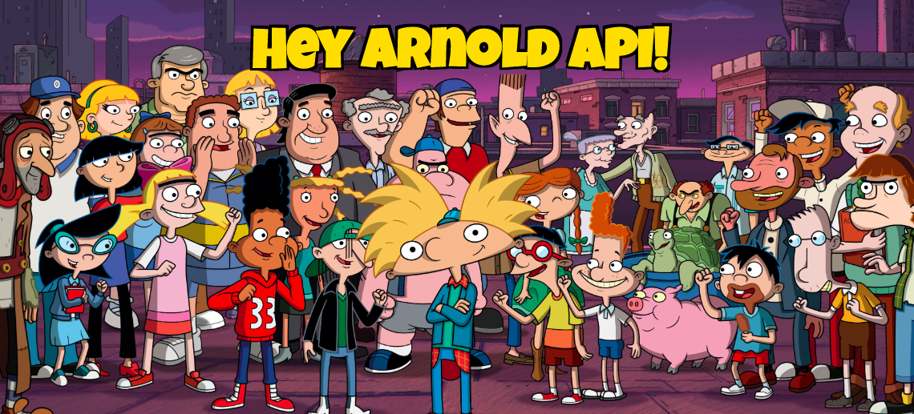

I created an API for the classic Nickelodeon show "Hey Arnold" which provides character information and GIFs. The information is publicly sourced and I do not claim to own it. For information on usage/routes/endpoints visit the documentation: https://hey-arnold-api-documentation.netlify.com/

### The Tech ### 
* Node.js
* MongoDB
* Mongoose
* Cheerio
* SuperTest
* Jest
